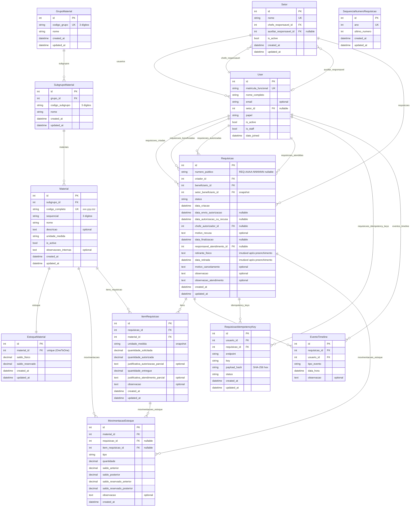

# Modelagem de Dados — WMS-SAEP

Sistema auxiliar de almoxarifado para o SAEP (Serviço de Água e Esgoto de Pirassununga). Backend Django 6 + DRF. Banco de dados PostgreSQL.

Apps cobertos: `users`, `materials`, `stock`, `requisitions`.

---

## Diagrama de Relacionamentos (ER)



---

## `users`

### Enum `PapelChoices`

| Valor | Label |
|---|---|
| `solicitante` | Solicitante |
| `auxiliar_setor` | Auxiliar de Setor |
| `chefe_setor` | Chefe de Setor |
| `auxiliar_almoxarifado` | Auxiliar de Almoxarifado |
| `chefe_almoxarifado` | Chefe de Almoxarifado |

---

### `Setor`

Unidade organizacional. Exatamente um chefe; auxiliar opcional.

| Campo | Tipo | Notas |
|---|---|---|
| `nome` | `CharField(200)` | `unique` |
| `chefe_responsavel` | `OneToOneField → User` | `PROTECT`, `related_name=setor_como_chefe` |
| `auxiliar_responsavel` | `OneToOneField → User` | `PROTECT`, `null`, `related_name=setor_como_auxiliar` |
| `is_active` | `BooleanField` | default `True` |
| `created_at` / `updated_at` | `DateTimeField` | `auto_now_add` / `auto_now` |

**Invariantes (`clean()`):**
- `chefe_responsavel.setor == self`
- `auxiliar_responsavel.setor == self` (quando presente)

---

### `User`

Estende `AbstractBaseUser + PermissionsMixin`. Login por matrícula funcional.

| Campo | Tipo | Notas |
|---|---|---|
| `matricula_funcional` | `CharField(20)` | `unique`, `USERNAME_FIELD` |
| `nome_completo` | `CharField(200)` | `REQUIRED_FIELDS` |
| `email` | `EmailField` | `blank` |
| `setor` | `ForeignKey → Setor` | `PROTECT`, `null`, `db_index` |
| `papel` | `CharField(30)` | `PapelChoices`, default `solicitante`, `db_index` |
| `is_active` | `BooleanField` | default `True` |
| `is_staff` | `BooleanField` | default `False` |
| `date_joined` | `DateTimeField` | `auto_now_add` |

---

## `materials`

Hierarquia SCPI de três níveis: Grupo (`xxx`) → Subgrupo (`yyy`) → Material (`zzz`).

### `GrupoMaterial`

| Campo | Tipo | Notas |
|---|---|---|
| `codigo_grupo` | `CharField(3)` | `unique`, regex `^\d{3}$` |
| `nome` | `CharField(200)` | — |
| `created_at` / `updated_at` | `DateTimeField` | — |

---

### `SubgrupoMaterial`

| Campo | Tipo | Notas |
|---|---|---|
| `grupo` | `ForeignKey → GrupoMaterial` | `PROTECT` |
| `codigo_subgrupo` | `CharField(3)` | regex `^\d{3}$` |
| `nome` | `CharField(200)` | — |
| `created_at` / `updated_at` | `DateTimeField` | — |

**Constraint DB:** `UniqueConstraint(grupo, codigo_subgrupo)` — `unique_subgrupo_por_grupo`

---

### `Material`

| Campo | Tipo | Notas |
|---|---|---|
| `subgrupo` | `ForeignKey → SubgrupoMaterial` | `PROTECT` |
| `codigo_completo` | `CharField(11)` | `unique`, regex `^\d{3}\.\d{3}\.\d{3}$` |
| `sequencial` | `CharField(3)` | regex `^\d{3}$` |
| `nome` | `CharField(200)` | — |
| `descricao` | `TextField` | `blank`, default `""` |
| `unidade_medida` | `CharField(20)` | — |
| `is_active` | `BooleanField` | default `True` |
| `observacoes_internas` | `TextField` | `blank`, default `""` |
| `created_at` / `updated_at` | `DateTimeField` | — |

**Constraint DB:** `UniqueConstraint(subgrupo, sequencial)` — `unique_material_por_subgrupo_sequencial`

**Invariante (`clean()`):**
- `codigo_completo == grupo.codigo_grupo + "." + subgrupo.codigo_subgrupo + "." + sequencial`

> `save()` e ORM direto não acionam `clean()`. Operações críticas devem usar `apps.materials.services.criar_material()`.

---

## `stock`

### Enum `TipoMovimentacao`

| Valor | Semântica |
|---|---|
| `SALDO_INICIAL` | Carga inicial vinda do SCPI. Sem referência a requisição/item. |
| `RESERVA_POR_AUTORIZACAO` | Reserva saldo quando requisição é autorizada. |
| `SAIDA_POR_ATENDIMENTO` | Baixa física + liberação de reserva ao atender item. |
| `LIBERACAO_RESERVA_ATENDIMENTO` | Libera reserva sem baixa física (diferença no atendimento parcial). |

---

### `EstoqueMaterial`

Saldo em tempo real por material. Relação 1-para-1 com `Material`.

| Campo | Tipo | Notas |
|---|---|---|
| `material` | `OneToOneField → Material` | `PROTECT`, `related_name=estoque` |
| `saldo_fisico` | `DecimalField(12,3)` | default `0` |
| `saldo_reservado` | `DecimalField(12,3)` | default `0` |
| `created_at` / `updated_at` | `DateTimeField` | — |

**Constraints DB:**
- `check_saldo_fisico_nao_negativo` — `saldo_fisico >= 0`
- `check_saldo_reservado_nao_negativo` — `saldo_reservado >= 0`

**Property:** `saldo_disponivel = saldo_fisico − saldo_reservado`

---

### `MovimentacaoEstoque`

Ledger imutável. Cada linha registra a movimentação e o saldo antes/depois.

| Campo | Tipo | Notas |
|---|---|---|
| `material` | `ForeignKey → Material` | `PROTECT` |
| `requisicao` | `ForeignKey → Requisicao` | `PROTECT`, `null` |
| `item_requisicao` | `ForeignKey → ItemRequisicao` | `PROTECT`, `null` |
| `tipo` | `CharField(30)` | `TipoMovimentacao` |
| `quantidade` | `DecimalField(12,3)` | `>= 0` |
| `saldo_anterior` | `DecimalField(12,3)` | `>= 0` |
| `saldo_posterior` | `DecimalField(12,3)` | `>= 0` |
| `saldo_reservado_anterior` | `DecimalField(12,3)` | default `0` |
| `saldo_reservado_posterior` | `DecimalField(12,3)` | default `0` |
| `observacao` | `TextField` | `blank` |
| `created_at` | `DateTimeField` | `auto_now_add` — sem `updated_at` |

**Imutabilidade:** `save()` em instância existente, `update()`, `delete()` e `bulk_update()` lançam `ValueError`. `bulk_create()` chama `full_clean()` em cada objeto antes de inserir.

**Regras de coerência por tipo (DB + `clean()`):**

| Tipo | Saldo físico | Saldo reservado | req / item |
|---|---|---|---|
| `SALDO_INICIAL` | `anterior=0`, `posterior=quantidade` | ambos `0` | ambos `null` |
| `RESERVA_POR_AUTORIZACAO` | inalterado (`posterior=anterior`) | `posterior = anterior + quantidade` | obrigatórios |
| `SAIDA_POR_ATENDIMENTO` | `posterior = anterior − quantidade` | `posterior = anterior − quantidade` | obrigatórios |
| `LIBERACAO_RESERVA_ATENDIMENTO` | inalterado | `posterior = anterior − quantidade` | obrigatórios |

---

## `requisitions`

### Enum `StatusRequisicao`

Fluxo principal:

```
rascunho
  └─► aguardando_autorizacao ◄─ retorno_rascunho ─┐
        ├─► recusada (final)                        │
        └─► autorizada                              │
              ├─► pronta_para_retirada_parcial      │
              └─► pronta_para_retirada              │
                    └─► retirada (final)            │
                          └─► estornada (final)     │
  (qualquer não-final) ──────► cancelada (final) ───┘
```

| Valor | Label | Final? |
|---|---|---|
| `rascunho` | Rascunho | — |
| `aguardando_autorizacao` | Aguardando Autorização | — |
| `autorizada` | Autorizada | — |
| `pronta_para_retirada_parcial` | Pronta para Retirada (Parcial) | — |
| `pronta_para_retirada` | Pronta para Retirada | — |
| `retirada` | Retirada | ✓ |
| `recusada` | Recusada | ✓ |
| `cancelada` | Cancelada | ✓ |
| `estornada` | Estornada | ✓ |

---

### Enum `TipoEvento`

| Valor | Descrição |
|---|---|
| `criacao` | Criação do rascunho |
| `envio_autorizacao` | Primeiro envio para autorização |
| `retorno_rascunho` | Retorno a rascunho pelo criador |
| `reenvio_autorizacao` | Reenvio após retorno |
| `autorizacao_total` | Autorização integral |
| `autorizacao_parcial` | Autorização com corte de quantidades |
| `recusa` | Recusa pelo chefe |
| `atendimento_parcial` | Separação parcial pelo almoxarifado |
| `atendimento` | Separação total pelo almoxarifado |
| `retirada` | Retirada física confirmada |
| `cancelamento` | Cancelamento |
| `estorno` | Estorno de requisição retirada |

---

### Enum `StatusIdempotencia`

| Valor | Label |
|---|---|
| `in_progress` | Em processamento |
| `completed` | Concluída |

---

### `SequenciaNumeroRequisicao`

Contador anual para geração de `numero_publico` (`REQ-AAAA-NNNNNN`).

| Campo | Tipo | Notas |
|---|---|---|
| `ano` | `PositiveIntegerField` | `unique` |
| `ultimo_numero` | `PositiveIntegerField` | default `0`, `check >= 0` |
| `created_at` / `updated_at` | `DateTimeField` | — |

---

### `Requisicao`

Entidade central do fluxo operacional.

| Campo | Tipo | Notas |
|---|---|---|
| `numero_publico` | `CharField(20)` | regex `REQ-\d{4}-\d{6}`, `null`, único quando preenchido |
| `criador` | `ForeignKey → User` | `PROTECT` |
| `beneficiario` | `ForeignKey → User` | `PROTECT`; imutável após saída de rascunho |
| `setor_beneficiario` | `ForeignKey → Setor` | `PROTECT`, `editable=False` — snapshot, imutável após saída de rascunho |
| `status` | `CharField(30)` | `StatusRequisicao`, default `rascunho` |
| `data_criacao` | `DateTimeField` | `auto_now_add` |
| `data_envio_autorizacao` | `DateTimeField` | `null` — data do **primeiro** envio |
| `data_autorizacao_ou_recusa` | `DateTimeField` | `null` |
| `chefe_autorizador` | `ForeignKey → User` | `PROTECT`, `null` |
| `motivo_recusa` | `TextField` | obrigatório quando `status=recusada` |
| `data_finalizacao` | `DateTimeField` | `null` |
| `responsavel_atendimento` | `ForeignKey → User` | `PROTECT`, `null` |
| `retirante_fisico` | `TextField` | imutável após preenchimento |
| `data_retirada` | `DateTimeField` | `null`, imutável após preenchimento |
| `motivo_cancelamento` | `TextField` | obrigatório quando cancelada pós-autorização |
| `observacao` | `TextField` | `blank` |
| `observacao_atendimento` | `TextField` | `blank` |
| `created_at` / `updated_at` | `DateTimeField` | — |

**Constraints DB:**

| Nome | Regra |
|---|---|
| `req_numero_publico_unico_quando_preenchido` | `numero_publico` único quando não nulo/vazio |
| `req_numero_publico_formato_valido_ou_vazio` | `numero_publico` nulo, vazio ou regex válido |
| `req_numero_publico_nao_pode_ser_preenchido_em_rascunho_nunca_enviado` | Rascunho sem envio não pode ter `numero_publico` |
| `req_numero_publico_obrigatorio_quando_enviada` | `data_envio_autorizacao` preenchida → `numero_publico` obrigatório |
| `req_motivo_recusa_obrigatorio_quando_recusada` | `status=recusada` → `motivo_recusa != ""` |
| `req_motivo_cancelamento_obrigatorio_quando_cancelada_pos_autorizacao` | `status=cancelada` + `data_autorizacao_ou_recusa` preenchida → `motivo_cancelamento != ""` |
| `req_auditoria_retirada_obrigatoria` | `status=retirada` → `data_retirada` e `retirante_fisico` preenchidos |

**Invariantes (`save()`):**
- Criação: `setor_beneficiario` atribuído automaticamente como snapshot de `beneficiario.setor`.
- Fora de rascunho: `beneficiario` e `setor_beneficiario` imutáveis.
- `data_retirada` e `retirante_fisico` imutáveis após preenchimento.

---

### `RequisicaoIdempotencyKey`

Proteção contra double-submit em transições de estado.

| Campo | Tipo | Notas |
|---|---|---|
| `usuario` | `ForeignKey → User` | `PROTECT` |
| `requisicao` | `ForeignKey → Requisicao` | `PROTECT` |
| `endpoint` | `CharField(64)` | não vazio |
| `key` | `CharField(128)` | não vazia |
| `payload_hash` | `CharField(64)` | regex `^[0-9a-f]{64}$` (SHA-256 hex) |
| `status` | `CharField(20)` | `StatusIdempotencia`, default `in_progress` |
| `created_at` / `updated_at` | `DateTimeField` | — |

**Constraint DB:** `UniqueConstraint(usuario, endpoint, requisicao, key)`

---

### `ItemRequisicao`

Linha de item. Três camadas de quantidade: solicitada → autorizada → entregue.

| Campo | Tipo | Notas |
|---|---|---|
| `requisicao` | `ForeignKey → Requisicao` | `PROTECT` |
| `material` | `ForeignKey → Material` | `PROTECT` |
| `unidade_medida` | `CharField(20)` | snapshot do material na criação |
| `quantidade_solicitada` | `DecimalField(12,3)` | `> 0` |
| `quantidade_autorizada` | `DecimalField(12,3)` | `>= 0`, `<= quantidade_solicitada`, default `0` |
| `justificativa_autorizacao_parcial` | `TextField` | obrigatória quando `0 < autorizada < solicitada` |
| `quantidade_entregue` | `DecimalField(12,3)` | `>= 0`, `<= quantidade_autorizada`, default `0` |
| `justificativa_atendimento_parcial` | `TextField` | obrigatória quando `0 < entregue < autorizada` |
| `observacao` | `TextField` | `blank` |
| `created_at` / `updated_at` | `DateTimeField` | — |

**Constraints DB:**

| Nome | Regra |
|---|---|
| `item_req_quantidade_solicitada_positiva` | `solicitada > 0` |
| `item_req_quantidade_autorizada_nao_negativa` | `autorizada >= 0` |
| `item_req_quantidade_entregue_nao_negativa` | `entregue >= 0` |
| `item_req_autorizada_lte_solicitada` | `autorizada <= solicitada` |
| `item_req_entregue_lte_autorizada` | `entregue <= autorizada` |
| `item_req_just_autorizacao_obrigatoria_quando_parcial` | `0 < autorizada < solicitada` → `justificativa_autorizacao_parcial != ""` |
| `item_req_just_atendimento_obrigatoria_quando_parcial` | `0 < entregue < autorizada` → `justificativa_atendimento_parcial != ""` |

---

### `EventoTimeline`

Log de auditoria imutável de cada transição de estado de uma requisição.

| Campo | Tipo | Notas |
|---|---|---|
| `requisicao` | `ForeignKey → Requisicao` | `PROTECT` |
| `tipo_evento` | `CharField(30)` | `TipoEvento` |
| `usuario` | `ForeignKey → User` | `PROTECT` |
| `data_hora` | `DateTimeField` | `auto_now_add` |
| `observacao` | `TextField` | `blank` |

**Imutabilidade:** `save()` em instância existente, `update()`, `delete()` e `bulk_update()` lançam `ValueError`. Sem `updated_at`.

---

## Padrões Transversais

### Campos de auditoria temporal

Modelos mutáveis: `created_at` + `updated_at`. Modelos imutáveis (`MovimentacaoEstoque`, `EventoTimeline`): apenas `created_at` — omissão de `updated_at` é intencional.

### Imutabilidade de ledger

| Modelo | Bloqueio |
|---|---|
| `MovimentacaoEstoque` | `save()`, `update()`, `delete()`, `bulk_update()` — todos lançam `ValueError` |
| `EventoTimeline` | idem |

### Snapshots históricos

| Modelo | Campo snapshot | Captura |
|---|---|---|
| `Requisicao` | `setor_beneficiario` | Setor do beneficiário no momento da criação |
| `ItemRequisicao` | `unidade_medida` | Unidade do material no momento da criação |

### Transações e locks

Toda mutação de `EstoqueMaterial` (`saldo_fisico`, `saldo_reservado`) + criação de `MovimentacaoEstoque` deve usar `transaction.atomic()` + `select_for_update()` sobre `EstoqueMaterial` para evitar race conditions de saldo.

### Camadas de validação

| Camada | Onde | Gatilho |
|---|---|---|
| DB constraints | `CheckConstraint`, `UniqueConstraint` | Toda escrita no banco |
| `clean()` | `Material`, `Setor` | `full_clean()`, admin |
| `save()` | `Requisicao`, `MovimentacaoEstoque`, `EventoTimeline` | Toda instância salva |
| Service | `criar_material()`, services de requisição | Operações de negócio |

> ORM direto (`Model.objects.create()`, `.update()`) não aciona `clean()`. Services são a única garantia de validação completa.
